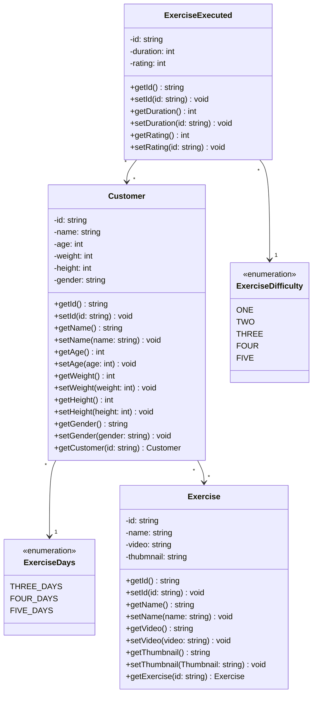

# Fábrica de Software 2025/1

Caio e gasparzinho

## Propostas de projeto

- Gerenciamento de treinos
  - Funcionalidade 1 Cadastrar dados do usuário
  - Funcionalidade 2 Cadastrar treinos
  - Funcionalidade 3 Gerar treino personalizado para usuário com AI
  - Funcionalidade 4 Automatizar modificações no treino de acordo com performance
  - Funcionalidade 6 Escolher tipo de treino
  - Funcionalidade 7 Consulta com profissionais da area

## Histórias de usuário

- Como usuário eu gostaria de escolher quantos dias na semana irei treinar e assim a IA irá gerar treinos.
- Como usuário eu gostaria de selecionar o plano do aplicativo
- Como usuário eu posso selecionar a dificuldade para cada treino efetuado
- Como usuário poderei avaliar treino
- Como usuário posso pedir dicas nutricionais

